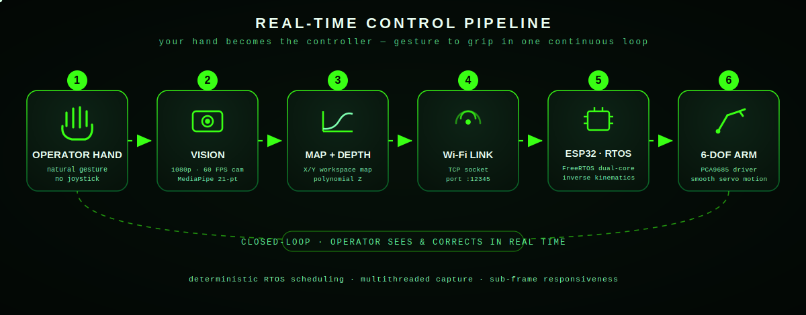
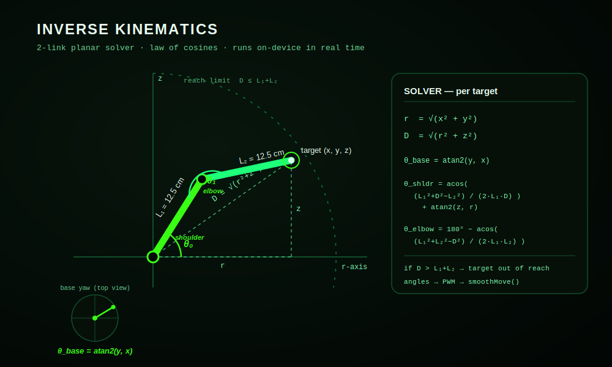

<!-- ╔══════════════════════════════════════════════════════════════════╗ -->
<!-- ║                    P R O J E C T   V E N O M                      ║ -->
<!-- ╚══════════════════════════════════════════════════════════════════╝ -->

<div align="center">

<a href="https://www.linkedin.com/posts/sheel-patel-a3939b287_projectvenom-republicplenarysummit2025-innovationforimpact-activity-7304489279823478784-SsNn">
  
</a>

<br/>


<br/>


#### [ Mission ](#the-mission) &nbsp;•&nbsp; [ Breakthrough ](#the-breakthrough) &nbsp;•&nbsp; [ Watch ](#-watch-venom-in-action) &nbsp;•&nbsp; [ Pipeline ](#real-time-control-pipeline) &nbsp;•&nbsp; [ Architecture ](#system-architecture) &nbsp;•&nbsp; [ Deep Dive ](#technical-deep-dive) &nbsp;•&nbsp; [ Recognition ](#recognition) &nbsp;•&nbsp; [ Team ](#the-team)

</div>


## The Mission

In explosive ordnance disposal, the distance between a human and a bomb is measured in trust placed in a machine. For decades that machine has been driven by **joysticks and button panels** — interfaces that demand months of training and insert a translation layer between *intent* and *action*. Every twist of a knob is a tiny delay, and in a field where seconds decide outcomes, delay is danger.

**VENOM** — *Vector Enhanced Neutralization and Explosive Ordnance Manipulation* — deletes that translation layer.

Instead of learning a controller, the operator simply **moves their hand**. A camera reads the gesture, software reconstructs it in 3D, and a dual-arm robotic manipulator mirrors the motion in real time. The robot becomes an extension of the body rather than a device to be operated. Lower cognitive load, faster response, delicate precision — at a safe standoff distance from the threat.

<div align="center">

| | |
|---|---|
| **Control modality** | Markerless hand motion-capture — no glove, no joystick |
| **Manipulator** | High-dexterity dual-arm, **6 degrees of freedom** per arm |
| **Perception** | Single RGB camera · 1920×1080 · 60 FPS · MediaPipe 21-point hand model |
| **Depth** | Monocular Z-estimation via polynomial regression on hand geometry |
| **Link** | Wi-Fi · TCP socket · on-board Access Point |
| **Brain** | ESP32 running **FreeRTOS** — deterministic, multi-threaded, real-time |
| **Domain** | Bomb disposal · hazard mitigation · emergency response |

</div>


## The Breakthrough

The core idea is deceptively simple and technically demanding: **make the human hand the controller, and make the robot obey it instantly.**

Doing that well means solving three hard problems at once and chaining them with near-zero latency:

1. **See the hand in 3D** from a single, ordinary camera — including depth, which a 2D image does not natively contain.
2. **Translate hand pose into joint angles** — the inverse-kinematics problem — fast enough to feel instantaneous.
3. **Move real motors smoothly and deterministically** while simultaneously listening to the network — without the system ever stuttering or blocking.

VENOM closes that loop continuously. The operator watches the arm respond and corrects on the fly, exactly like reaching with their own hand. It is a **closed-loop, real-time human–machine interface** — and it was built, end to end, by two second-year engineering students.


## ▶ Watch VENOM in Action

<div align="center">

[](https://www.linkedin.com/posts/sheel-patel-a3939b287_projectvenom-republicplenarysummit2025-innovationforimpact-activity-7304489279823478784-SsNn)

Full introduction, working demo, and Tech Expo 2025 montage — on LinkedIn.

</div>

<!-- ════════════════════════════════════════════════════════════════════ -->
<!--  ▶▶▶  HOW TO MAKE THE VIDEO PLAY *INSIDE* THIS README  ◀◀◀           -->
<!--                                                                      -->
<!--  GitHub cannot embed a LinkedIn player, but it CAN play an uploaded  -->
<!--  MP4 inline. Two ways to do it — pick one:                          -->
<!--                                                                      -->
<!--  EASIEST (recommended):                                             -->
<!--   1. On github.com, open this README and click the pencil (Edit).    -->
<!--   2. Drag-and-drop your demo video file (.mp4) right onto THIS line. -->
<!--   3. GitHub uploads it and auto-inserts a link that looks like:      -->
<!--        https://github.com/<user>/<repo>/assets/<id>/<hash>.mp4       -->
<!--   4. Commit. A play-in-place video player now renders here.          -->
<!--                                                                      -->
<!--  ALTERNATIVE (store the file in the repo):                          -->
<!--   1. Put your video at  assets/venom-demo.mp4                        -->
<!--   2. Replace this comment with the tag below (swap <user>/<repo>):   -->
<!--                                                                      -->
<!--   <div align="center">                                              -->
<!--     <video src="https://github.com/<user>/<repo>/raw/main/assets/venom-demo.mp4" controls width="82%"></video> -->
<!--   </div>                                                            -->
<!--                                                                      -->
<!--  Tip: keep the file under 100 MB. The .mov from your phone works too.-->
<!-- ════════════════════════════════════════════════════════════════════ -->

> [!NOTE]
> **Want the video to play right here instead of opening LinkedIn?** It takes 30 seconds — the exact steps are written as a comment immediately above this line in the README source. The short version: open this file in the GitHub editor and **drag-and-drop your `.mp4` onto the page**; GitHub hosts it and renders an inline player automatically.


## Real-Time Control Pipeline

One continuous loop turns a gesture into a grip. Each stage hands off to the next with minimal latency; the operator stays in the loop the entire time.

<div align="center">
  
</div>

The two halves of VENOM were written by hand by the two of us: **the computer-vision perception layer** (Python, on the host PC) and **the inverse-kinematics + RTOS control layer** (C++, on the ESP32). They speak to each other over a single Wi-Fi TCP link carrying nothing but three numbers — `x y z` — the position the robot's hand should move to.


## System Architecture

```mermaid
flowchart LR
  H["🖐️ Operator Hand"]:::op

  subgraph HOST["💻 HOST PC · Computer Vision · Python"]
    direction TB
    CAM["📷 Camera<br/>1920×1080 · 60 FPS"] --> MP["✋ MediaPipe Hands<br/>21 landmarks · threaded"]
    MP --> XY["📐 Wrist to X/Y<br/>map + clamp to workspace"]
    MP --> ZZ["📏 Knuckle span 5–17<br/>polynomial regression to Z"]
    XY --> PKT["📦 packet: x y z"]
    ZZ --> PKT
  end

  PKT -->|📡 Wi-Fi · TCP :12345| WIFI

  subgraph ESP["🤖 ESP32 · FreeRTOS · C++"]
    direction TB
    WIFI["handleWifiTask · core 0"] --> Q1["📥 queue · moveAssemblyWC"]
    Q1 --> IK["calculateAnglesTask<br/>law of cosines · core 1"]
    IK --> Q2["📥 queue · moveAssemblyJst"]
    Q2 --> MOV["moveAssemblyJstTask<br/>smoothMove · core 1"]
    MOV --> PWM["⚙️ PCA9685 · PWM 50 Hz"]
  end

  PWM --> ARM["🦾 6-DOF Arm<br/>base · shoulder · elbow<br/>roll · pitch · claw"]

  H -. gesture .-> CAM
  ARM -. closed loop .-> H

  classDef op fill:#02140a,stroke:#39ff14,color:#d6ffe6;
```




## Technical Deep Dive

### 1 · Computer Vision — turning an ordinary webcam into a 3D controller
`Trial2_30Samples.py` · Python · OpenCV · MediaPipe — *written by Sheel Patel*

The perception layer captures the operator's hand at 1080p / 60 FPS and runs Google's **MediaPipe Hands** to extract 21 skeletal landmarks every frame. Detection and tracking confidence are deliberately tuned low (0.2) — in this control loop, *responsiveness* matters more than caution, because the human is always watching and correcting.

Two design decisions make it feel instantaneous:

- **A producer–consumer threading model.** A dedicated capture thread pushes frames into a bounded `frame_queue`; a separate processing thread runs inference. Capture never waits on inference, and when the queue is full, stale frames are dropped rather than queued — so the robot always tracks the *latest* hand position, never a backlog.
- **Monocular depth from hand geometry.** A single camera can't see depth — so VENOM infers it. The pixel distance between two knuckles (landmarks 5 and 17) shrinks as the hand moves away. Seventeen hand-measured calibration points are fit with a **second-degree polynomial** (`numpy.polyfit`), turning that apparent width into a real-world Z in centimetres.

The wrist landmark is mapped to the robot's X/Y workspace and clamped to its reachable envelope, the depth model supplies Z, and the result is streamed as a compact `x y z` string over a **TCP socket** to the ESP32. A live readings-per-second counter keeps the pipeline honest.

### 2 · Inverse Kinematics & RTOS firmware — deterministic motion on a microcontroller
`workingIKCV.ino` · C++ · ESP32 · FreeRTOS — *written by Anirudh Nautiyal*

The ESP32 hosts its **own Wi-Fi Access Point and TCP server** (port 12345) — the PC connects directly to the robot, no router required in the field. On top of that runs the part that makes VENOM feel alive: a **FreeRTOS** real-time design that does several things at once without ever blocking.

- **Concurrency, by design.** Networking, math, and motion are split into separate FreeRTOS tasks **pinned across both ESP32 cores** and connected by thread-safe queues: `handleWifiTask` ingests packets on core 0, `calculateAnglesTask` solves geometry on core 1, and `moveAssemblyJstTask` drives the servos at a higher priority on core 1. Incoming samples are averaged in pairs to smooth sensor noise before they ever reach the math.
- **Inverse kinematics in real time.** Each target `(x, y, z)` is solved with a **2-link planar model and the law of cosines** — base rotation from `atan2`, shoulder and elbow from the link geometry — with a reachability guard that rejects any point beyond the arm's `L₁ + L₂` span (both links 12.5 cm). See the math below.
- **Motion that looks human.** Raw servo jumps look robotic and jerk the payload. `smoothMove()` applies a **distance-aware deceleration curve** — easing each joint into its target and slowing as it arrives — with per-joint timing tuned individually. The angles are converted to PWM and pushed to six channels through an **Adafruit PCA9685** driver at 50 Hz: base, shoulder, elbow, roll, pitch, and claw.

> **Why an RTOS?** A normal `loop()` does one thing at a time; a dropped beat means a stutter. FreeRTOS gives **deterministic scheduling** — the firmware can receive Wi-Fi data, compute kinematics, and move multiple servos *concurrently* without lag or task conflict. In EOD, predictable timing is not a nicety; it is the requirement.

<div align="center">
  
</div>

<details>
<summary><b>Engineering details that didn't make the headline</b> — click to expand</summary>

<br/>

- **Threading & queues:** bounded CV `frame_queue` (drops stale frames); ESP32 queues sized generously (`moveAssemblyWC` up to 1000 packets) so a network burst never stalls the solver.
- **Coordinate clamping:** X/Y/Z are clamped to the physical reachable envelope before transmission *and* re-checked on-device — defence in depth against impossible targets.
- **Servo channels:** 6 independent PWM channels via PCA9685; each joint initialised to a safe neutral pose on boot.
- **Smoothing:** the deceleration factor scales with remaining distance, with a minimum step so the joint never stalls one tick short of target.
- **Built to grow:** the firmware also carries dormant scaffolding for **ESP-NOW** wireless glove input and a **doubly-linked-list motion record-and-replay** engine — the architecture was designed to extend, not just to demo.

</details>


## Inverse Kinematics — the math, exactly as it runs

For a target `(x, y, z)` and two equal links `L₁ = L₂ = 12.5 cm`:

```text
  r          = √(x² + y²)                              ← reach in the X/Y plane
  D          = √(r² + z²)                              ← straight-line distance to target
  θ_base     = atan2(y, x)                             ← base yaw
  θ_shoulder = acos( (L₁² + D² − L₂²) / (2·L₁·D) ) + atan2(z, r)
  θ_elbow    = 180° − acos( (L₁² + L₂² − D²) / (2·L₁·L₂) )

  reachability:  if D > L₁ + L₂   →   target out of reach (rejected)
  then:          angles → PWM → smoothMove() → servo
```


## Tech Stack

<div align="center">

| Layer | Technology | Role |
|:---|:---|:---|
| **Perception** | Python · OpenCV · MediaPipe · NumPy | Hand tracking, 3D reconstruction, depth regression |
| **Concurrency (PC)** | Python `threading` + `queue` | Non-blocking capture / inference pipeline |
| **Link** | Wi-Fi · TCP sockets | Streams `x y z` targets, PC → robot |
| **Control** | C++ · ESP32 · FreeRTOS | Deterministic, multi-core real-time firmware |
| **Kinematics** | 2-link planar IK · law of cosines | Pose → joint angles, on-device |
| **Actuation** | Adafruit PCA9685 · 6× servos | 6-DOF dual-arm motion @ 50 Hz |

</div>

## Repository Structure

```text
VENOM/
├── Trial2_30Samples.py   # Computer vision — hand tracking, depth, comms   ·  Sheel Patel
├── workingIKCV.ino       # ESP32 firmware — FreeRTOS + inverse kinematics   ·  Anirudh Nautiyal
├── assets/               # Cinematic README visuals (animated SVG)
├── LICENSE               # GNU GPL v3.0
└── README.md             # You are here
```


## Recognition

> *"What began as a concept soon evolved into a project recognized on a national platform."*

VENOM was awarded **1st place in the Science & Technology category** at the **Republic Plenary Summit — Limitless India Youth Hackathon 2025**, hosted by the Republic World team.

- 🏆 **National winners** — Science & Technology category.
- 🌏 Recognized among the **Top 30 youth under 30 in India**.
- ⚔️ Selected from a field of **10,000+ engineers, startups and innovators** nationwide.
- 🎖️ Among only **9 individuals** invited to be photographed with the **Hon'ble Prime Minister of India, Shri Narendra Modi**.
- 🎓 Achieved as **second-year engineering students**, and showcased live at **Tech Expo 2025**.


## The Team

Two builders, one closed loop.

<div align="center">

| | Engineer | Owned |
|:---:|:---|:---|
| 👁️ | **[Sheel Patel](https://www.linkedin.com/in/sheel-patel-a3939b287)** | Computer vision — MediaPipe tracking, monocular depth, threading, PC↔robot comms |
| 🦾 | **Anirudh Nautiyal** | Inverse kinematics & RTOS firmware — FreeRTOS architecture, control, actuation |

</div>

Every line of code in this repository was written by the two of us, by hand.

## Acknowledgements

Our gratitude to the university leadership — **Dr. Devanshu Patel**, **Dr. Vipul Vekariya**, and **Dr. Sanjay Agal** — for an environment that pushes students to build. A special thanks to **Mahidhar Kothuru (byteXL)** for mentorship that sharpened the fundamentals we leaned on under pressure, and to the **Republic World team** — with **Pranav Kulkarni** and **Gopi Shah** — for an unforgettable platform.


<div align="center">
  

<br/>

*Passion, persistence, and teamwork can drive meaningful innovation.*

<sub>VENOM · Vector Enhanced Neutralization and Explosive Ordnance Manipulation · Oct 2024 → Feb 2025 · Licensed under GPL-3.0</sub>

</div>
