<!-- ╔══════════════════════════════════════════════════════════════════╗ -->
<!-- ║                    P R O J E C T   V E N O M                      ║ -->
<!-- ╚══════════════════════════════════════════════════════════════════╝ -->

<div align="center">


<br/>


<br/>


#### [ Watch ](#-watch-the-demo) &nbsp;•&nbsp; [ At a Glance ](#at-a-glance) &nbsp;•&nbsp; [ How It Works ](#how-it-works) &nbsp;•&nbsp; [ Architecture ](#system-architecture) &nbsp;•&nbsp; [ The Math ](#the-math) &nbsp;•&nbsp; [ Deep Dive ](#under-the-hood) &nbsp;•&nbsp; [ Recognition ](#recognition) &nbsp;•&nbsp; [ Team ](#the-team)

</div>


## ▶ Watch the Demo

<div align="center">

<video src="https://github.com/Sheel34/VENOM/raw/main/assets/venom-demo.mp4" poster="https://github.com/Sheel34/VENOM/raw/main/assets/venom-thumb.jpg" controls playsinline width="82%"></video>

<br/>

<sub>A bare hand moves &#8594; the arm mirrors it in real time. Press play — it streams right here, fullscreen optional. No tab-hopping.</sub>

</div>

> [!NOTE]
> **Not playing on your phone?** GitHub serves a repo-hosted `.mp4` as a plain download on iOS, so the inline player can go blank there. For a player that works on **every** device, swap the line above for a GitHub-hosted upload: open this README in the GitHub editor (pencil), **drag `assets/venom-demo.mp4` onto the page**, wait for the `…/user-attachments/assets/…` link to appear, and commit. That URL plays everywhere.


## At a Glance

<div align="center">

| | |
|---|---|
| **Control modality** | Markerless hand motion-capture — no glove, no joystick |
| **Manipulator** | High-dexterity dual-arm, **6 degrees of freedom** per arm |
| **Perception** | Single RGB camera · 1920×1080 · 60 FPS · MediaPipe 21-point hand model |
| **Depth** | Monocular Z-estimation via polynomial regression on hand geometry |
| **Link** | Wi-Fi · TCP socket · on-board Access Point |
| **Brain** | ESP32 running **FreeRTOS** — deterministic, multi-threaded, real-time |
| **Domain** | Bomb disposal · hazard mitigation · emergency response |

</div>


## How It Works

<div align="center">
  
</div>

<div align="center"><sub>One continuous loop turns a gesture into a grip. The operator stays in the loop the entire time — watch, correct, repeat.</sub></div>


## System Architecture

```mermaid
flowchart LR
  H["🖐️ Operator Hand"]:::op

  subgraph HOST["💻 HOST PC · Computer Vision · Python"]
    direction TB
    CAM["📷 Camera<br/>1920×1080 · 60 FPS"] --> MP["✋ MediaPipe Hands<br/>21 landmarks · threaded"]
    MP --> XY["📐 Wrist to X/Y<br/>map + clamp to workspace"]
    MP --> ZZ["📏 Knuckle span 5–17<br/>polynomial regression to Z"]
    XY --> PKT["📦 packet: x y z"]
    ZZ --> PKT
  end

  PKT -->|📡 Wi-Fi · TCP :12345| WIFI

  subgraph ESP["🤖 ESP32 · FreeRTOS · C++"]
    direction TB
    WIFI["handleWifiTask · core 0"] --> Q1["📥 queue · moveAssemblyWC"]
    Q1 --> IK["calculateAnglesTask<br/>law of cosines · core 1"]
    IK --> Q2["📥 queue · moveAssemblyJst"]
    Q2 --> MOV["moveAssemblyJstTask<br/>smoothMove · core 1"]
    MOV --> PWM["⚙️ PCA9685 · PWM 50 Hz"]
  end

  PWM --> ARM["🦾 6-DOF Arm<br/>base · shoulder · elbow<br/>roll · pitch · claw"]

  H -. gesture .-> CAM
  ARM -. closed loop .-> H

  classDef op fill:#14110c,stroke:#e0392f,color:#efe7d8;
```




## The Math

<div align="center">
  
</div>

<details>
<summary><b>The solver in plain text</b> — exactly as it runs on-device</summary>

<br/>

For a target `(x, y, z)` and two equal links `L₁ = L₂ = 12.5 cm`:

```text
  r          = √(x² + y²)                              ← reach in the X/Y plane
  D          = √(r² + z²)                              ← straight-line distance to target
  θ_base     = atan2(y, x)                             ← base yaw
  θ_shoulder = acos( (L₁² + D² − L₂²) / (2·L₁·D) ) + atan2(z, r)
  θ_elbow    = 180° − acos( (L₁² + L₂² − D²) / (2·L₁·L₂) )

  reachability:  if D > L₁ + L₂   →   target out of reach (rejected)
  then:          angles → PWM → smoothMove() → servo
```

</details>


## Under the Hood

<sub>The headline is the demo above. The detail is here — open what interests you.</sub>

<details>
<summary><b>The mission &amp; the breakthrough</b> — why hand-control, and what was hard about it</summary>

<br/>

In explosive ordnance disposal, the distance between a human and a bomb is measured in trust placed in a machine. For decades that machine has been driven by **joysticks and button panels** — interfaces that demand months of training and insert a translation layer between *intent* and *action*. In a field where seconds decide outcomes, that delay is danger.

**VENOM** — *Vector Enhanced Neutralization and Explosive Ordnance Manipulation* — deletes the translation layer. The operator simply **moves their hand**. A camera reads the gesture, software reconstructs it in 3D, and a dual-arm robotic manipulator mirrors the motion in real time, at a safe standoff distance.

Doing that well means solving three hard problems at once, chained with near-zero latency:

1. **See the hand in 3D** from a single ordinary camera — including depth, which a 2D image does not natively contain.
2. **Translate hand pose into joint angles** — the inverse-kinematics problem — fast enough to feel instantaneous.
3. **Move real motors smoothly and deterministically** while simultaneously listening to the network — without ever stuttering or blocking.

VENOM closes that loop continuously — a **closed-loop, real-time human–machine interface**, built end to end by two second-year engineering students.

</details>

<details>
<summary><b>Computer vision</b> — turning an ordinary webcam into a 3D controller</summary>

<br/>

`Trial2_30Samples.py` · Python · OpenCV · MediaPipe — *written by Sheel Patel*

The perception layer captures the operator's hand at 1080p / 60 FPS and runs **MediaPipe Hands** to extract 21 skeletal landmarks every frame. Confidence is tuned low (0.2) — responsiveness matters more than caution, because the human is always watching and correcting.

- **Producer–consumer threading.** A capture thread pushes frames into a bounded `frame_queue`; a separate thread runs inference. When the queue is full, stale frames are dropped — the robot always tracks the *latest* hand position, never a backlog.
- **Monocular depth from hand geometry.** The pixel distance between knuckles (landmarks 5 and 17) shrinks as the hand recedes. Seventeen calibration points are fit with a **second-degree polynomial** (`numpy.polyfit`), turning apparent width into a real-world Z in centimetres.

The wrist maps to the robot's X/Y workspace (clamped to its reachable envelope), depth supplies Z, and the result streams as a compact `x y z` string over **TCP** to the ESP32.

</details>

<details>
<summary><b>Inverse kinematics &amp; RTOS firmware</b> — deterministic motion on a microcontroller</summary>

<br/>

`workingIKCV.ino` · C++ · ESP32 · FreeRTOS — *written by Anirudh Nautiyal*

The ESP32 hosts its **own Wi-Fi Access Point and TCP server** (port 12345) — the PC connects directly to the robot, no router required in the field.

- **Concurrency, by design.** Networking, math, and motion are split into FreeRTOS tasks **pinned across both cores** and connected by thread-safe queues: `handleWifiTask` (core 0), `calculateAnglesTask` (core 1), `moveAssemblyJstTask` (core 1, higher priority).
- **IK in real time.** Each target `(x, y, z)` is solved with a **2-link planar model and the law of cosines**, with a reachability guard rejecting any point beyond `L₁ + L₂` (both 12.5 cm).
- **Motion that looks human.** `smoothMove()` applies a **distance-aware deceleration curve**, easing each joint into its target. Angles → PWM → six channels via an **Adafruit PCA9685** at 50 Hz: base, shoulder, elbow, roll, pitch, claw.

> **Why an RTOS?** A normal `loop()` does one thing at a time; a dropped beat means a stutter. FreeRTOS gives **deterministic scheduling** — receive Wi-Fi data, compute kinematics, and move servos *concurrently* without lag. In EOD, predictable timing is the requirement.

Dormant scaffolding is also in place for **ESP-NOW** glove input and a **linked-list record-and-replay** engine — the architecture was designed to extend, not just to demo.

</details>


## Tech Stack

<div align="center">

| Layer | Technology | Role |
|:---|:---|:---|
| **Perception** | Python · OpenCV · MediaPipe · NumPy | Hand tracking, 3D reconstruction, depth regression |
| **Concurrency (PC)** | Python `threading` + `queue` | Non-blocking capture / inference pipeline |
| **Link** | Wi-Fi · TCP sockets | Streams `x y z` targets, PC → robot |
| **Control** | C++ · ESP32 · FreeRTOS | Deterministic, multi-core real-time firmware |
| **Kinematics** | 2-link planar IK · law of cosines | Pose → joint angles, on-device |
| **Actuation** | Adafruit PCA9685 · 6× servos | 6-DOF dual-arm motion @ 50 Hz |

</div>

<details>
<summary><b>Repository structure</b></summary>

<br/>

```text
VENOM/
├── Trial2_30Samples.py   # Computer vision — hand tracking, depth, comms   ·  Sheel Patel
├── workingIKCV.ino       # ESP32 firmware — FreeRTOS + inverse kinematics   ·  Anirudh Nautiyal
├── assets/               # Demo video + cinematic README visuals (animated SVG)
├── LICENSE               # GNU GPL v3.0
└── README.md             # You are here
```

</details>


## Recognition

<div align="center">

🏆 **1st place — Science &amp; Technology** · Republic Plenary Summit, Limitless India Youth Hackathon 2025

</div>

- 🌏 Recognized among the **Top 30 youth under 30 in India**.
- ⚔️ Selected from a field of **10,000+ engineers, startups and innovators** nationwide.
- 🎖️ Among only **9 individuals** invited to be photographed with the **Hon'ble Prime Minister of India, Shri Narendra Modi**.
- 🎓 Built and showcased live as **second-year engineering students** at **Tech Expo 2025**.


## The Team

Two builders, one closed loop.

<div align="center">

| | Engineer | Owned |
|:---:|:---|:---|
| 👁️ | **[Sheel Patel](https://www.linkedin.com/in/sheel-patel-a3939b287)** | Computer vision — MediaPipe tracking, monocular depth, threading, PC↔robot comms |
| 🦾 | **Anirudh Nautiyal** | Inverse kinematics & RTOS firmware — FreeRTOS architecture, control, actuation |

</div>

Every line of code in this repository was written by the two of us, by hand.

<details>
<summary><b>Acknowledgements</b></summary>

<br/>

Our gratitude to the university leadership — **Dr. Devanshu Patel**, **Dr. Vipul Vekariya**, and **Dr. Sanjay Agal**. A special thanks to **Mahidhar Kothuru (byteXL)** for mentorship, and to the **Republic World team** — with **Pranav Kulkarni** and **Gopi Shah** — for an unforgettable platform.

</details>


<div align="center">
  

<br/>

<sub>VENOM · Vector Enhanced Neutralization and Explosive Ordnance Manipulation · Oct 2024 → Feb 2025 · Licensed under GPL-3.0</sub>

</div>
